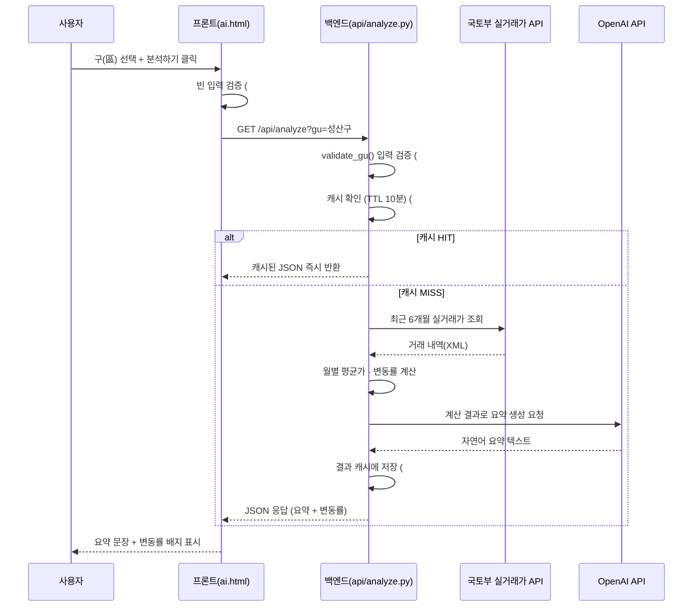
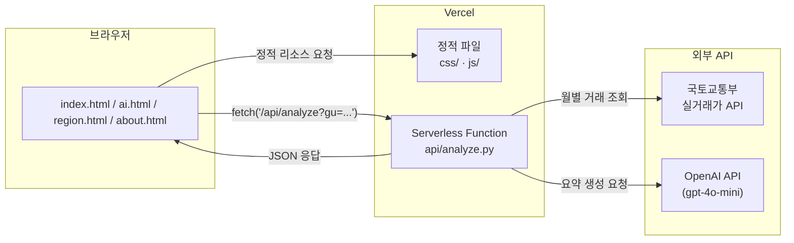

# 창원댁 🏙️

> 국토교통부 실거래가 데이터로 창원 아파트 매매 시장 흐름을 AI가 쉽게 요약해 주는 웹 서비스

**🔗 배포 URL:** https://changwondaek.vercel.app
**💻 GitHub:** https://github.com/ilililililil4319/A1-3


---

## 1. 서비스 소개

창원에서 내 집 마련이나 이사를 계획하는 사람들은 "지금이 살 때인가, 기다려야 하는가"를 고민합니다. 하지만 그 판단 근거는 대부분 중개업소의 설명이나 커뮤니티 여론에 의존해 객관성이 떨어집니다.

**창원댁**은 국토교통부가 공개하는 **아파트 매매 실거래가** 데이터를 사용해, 창원 5개 구(의창·성산·마산합포·마산회원·진해)의 최근 6개월 매매가 흐름을 계산하고, 이를 **AI가 이해하기 쉬운 한두 문장으로 요약**해 줍니다.

- **타겟 사용자:** 창원에서 내 집 마련 또는 이사를 계획 중인 실수요자
- **핵심 가치:** 감이 아닌 "실제 거래 데이터"로 시장을 판단

---

## 2. 서비스 개요 및 페이지 구성

| 항목 | 내용 |
|---|---|
| 서비스명 | 창원댁 |
| 타겟 | 창원에서 내 집 마련 또는 이사를 계획 중인 사람 |
| 목적 | 국토부 실거래가 데이터로 창원 5개 구 아파트 매매 시장 동향을 AI 요약으로 쉽게 파악 |
| 데이터 범위 | 아파트 매매 실거래가 · 5개 구 전체 · 최근 6개월 평균가 비교 |
| AI 기능 | 구 선택 시 최근 6개월 평균 매매가 변동을 자연어 코멘트로 요약 생성 |

**페이지 구성 (4개)**

| 페이지 | 설명 |
|---|---|
| 메인 (`index.html`) | 서비스 소개, 핵심 가치 제안, 주요 페이지 이동 |
| AI 시장분석 (`ai.html`) | 구 선택 → 최근 6개월 평균 매매가 조회 → **AI 요약 코멘트** 생성 (핵심 기능) |
| 지역별 시세 (`region.html`) | 창원 5개 구 시세 비교 표 |
| 소개·문의 (`about.html`) | 서비스 취지, 데이터 출처, 면책 문구, 문의 |

**완성된 페이지 미리보기**

메인 페이지


AI 시장분석


지역별 시세


소개·문의


---

## 3. 기술 스택

| 구분 | 사용 기술 |
|---|---|
| 프론트엔드 | HTML / CSS / JavaScript (바닐라, 프레임워크 미사용) |
| 백엔드 | Vercel Serverless Functions (Python) |
| AI | OpenAI API (`gpt-4o-mini`) |
| 부동산 데이터 | 국토교통부 아파트 매매 실거래가 API (공공데이터포털) |
| 배포 | Vercel |
| 버전 관리 | Git / GitHub |
| 방문자 분석 | Vercel Web Analytics (보너스 과제) |

---

## 4. 프로젝트 구조

```
A1-3/
├── README.md
├── .gitignore                # Git 제외 목록 (루트)
├── docs/                     # 기획서 등 문서
└── web/                      # 웹 서비스 (Vercel 배포 루트)
    ├── index.html            # 메인 페이지
    ├── ai.html               # AI 시장분석 (핵심 기능)
    ├── region.html           # 지역별 시세
    ├── about.html            # 소개·문의
    ├── css/style.css         # 공통 스타일
    ├── js/common.js          # 공통 스크립트 (모바일 메뉴)
    ├── api/analyze.py        # 백엔드 함수 (국토부 + OpenAI)
    ├── images/               # 증빙 스크린샷
    ├── requirements.txt      # Python 라이브러리 목록
    ├── vercel.json           # 배포 라우팅 설정
    ├── .gitignore
    └── .env.local            # API 키 (git 제외)
```

---

## 5. 과제 수행방법

### 데이터 흐름 (시스템 워크플로우)

```
[사용자] 구 선택 → 분석하기 버튼
    │  fetch('/api/analyze?gu=성산구')
    ▼
[백엔드 api/analyze.py]
    1. 국토부 실거래가 API 호출 (최근 6개월, 선택한 구)
    2. 월별 평균 매매가 계산 + 변동률(%) 산출
    3. 계산 결과를 OpenAI API에 전달 → 자연어 요약 생성
    4. 결과를 JSON으로 반환
    ▼
[프론트] AI 요약 문장 + 변동률 배지를 화면에 표시
```

**시퀀스 다이어그램** (GitHub에서 자동 렌더링됩니다)



### 아키텍처 개요



### AI 기능 설계

- **입력:** 사용자가 창원 5개 구 중 하나를 선택
- **출력:** "최근 6개월간 OO구 아파트 평균 매매가는 약 O% 상승/하락했습니다" 형태의 자연어 코멘트 + 변동률 배지
- **실패 처리:** 빈 입력("구를 선택해주세요"), API 오류, 응답 지연(타임아웃) 안내

### AI 프롬프트 (요약)

> 부동산 데이터를 일반인이 이해하기 쉽게 설명하는 애널리스트 역할. 데이터에 근거한 사실만 서술하고 투자 조언은 하지 않으며, "평균 매매가가 약 O% 상승/하락했습니다" 형태로 2~3문장 요약.

### API 요청/응답 예시

**요청**

```bash
curl "https://changwondaek.vercel.app/api/analyze?gu=성산구"
```

**성공 응답 (200)**

```json
{
  "gu": "성산구",
  "change": 3.4,
  "monthly": [
    { "month": "202502", "avg": 40073 },
    { "month": "202503", "avg": 39207 },
    { "month": "202504", "avg": 41764 },
    { "month": "202505", "avg": 40297 },
    { "month": "202506", "avg": 42906 },
    { "month": "202507", "avg": 41449 }
  ],
  "summary": "최근 6개월 동안 창원시 성산구의 아파트 평균 매매가는 약 3.4% 상승했습니다. ...",
  "cached": false
}
```

- `cached: true`인 경우, 동일한 구를 10분 이내에 재조회하여 캐시된 결과를 즉시 반환했다는 뜻입니다. (아래 "성능·응답 지연 개선" 참고)

**실패 응답 예시**

```json
// 구를 선택하지 않았거나 빈 값으로 호출한 경우 (400)
{ "error": "구를 선택해주세요." }
```

```json
// 목록에 없는 값이거나 비정상적으로 긴 입력을 보낸 경우 (400)
{ "error": "지원하지 않는 지역입니다. 창원시 5개 구 중에서 선택해주세요." }
```

```json
// 해당 기간 데이터가 부족하거나 외부 API 오류가 발생한 경우 (500)
{ "error": "해당 기간에 분석할 거래 데이터가 충분하지 않습니다." }
```

**AI 코딩 도구(VS Code) 작업 화면**

AI 코딩 도구를 활용해 코드를 작성하고, 오류 발생 시 직접 원인을 파악·수정하며 진행했습니다.


**AI 시장분석 동작 화면**


**백엔드 API 응답 (JSON)**


---

## 6. 전체 진행 로드맵 (STEP 1~15)

| STEP | 내용 |
|---|---|
| 1 | 서비스 기획서 작성 (목적/타겟/페이지 구성/AI기능 정의) |
| 2 | 프로젝트 폴더 구조 초기화 + GitHub 저장소 + .gitignore 설정 |
| 3 | 보안 세팅 (.gitignore, .env.local로 API 키 관리) |
| 4 | Git 저장소 초기화 및 GitHub 연결 |
| 5 | 메인 페이지(Hero) HTML/CSS 구현 |
| 6 | 추가 페이지/섹션 3개 이상 + 네비게이션 구현 |
| 7 | 반응형 적용 + 2가지 화면 크기 확인 |
| 8 | 국토부 실거래가 API 연동 (법정동코드 매핑, 데이터 조회) |
| 9 | 6개월 평균가 계산 + 변동률 산출 |
| 10 | OpenAI API 연동 (데이터 → 자연어 요약) |
| 11 | 백엔드 api/analyze.py 작성 (Serverless Function) |
| 12 | 프론트-백엔드 연결(fetch) + 실패 처리(빈 입력/오류/지연) |
| 13 | GitHub 푸시 + Vercel 배포 + 환경변수 설정 |
| 14 | 배포 URL 동작 검증 및 재배포 (라우팅 설정) |
| 15 | 방문자 분석(보너스) 적용 + README·증빙 정리 |

---

## 7. 실행 / 배포 방법

### 로컬에서 테스트

```bash
# 1) 저장소 클론
git clone https://github.com/ilililililil4319/A1-3.git
cd A1-3/web

# 2) Python 라이브러리 설치
pip install -r requirements.txt

# 3) 환경 변수 파일(.env.local) 생성 (아래 8번 참고)

# 4) index.html을 브라우저로 열어 프론트 확인
#    (백엔드 함수는 Vercel 환경에서 동작 → 전체 동작은 배포 후 확인)
```

### Vercel 배포

```bash
npm install -g vercel      # Vercel CLI 설치 (최초 1회)
vercel login               # 로그인
cd web                     # 반드시 web 폴더 기준
vercel --prod              # 프로덕션 배포
```

> 배포 루트는 `web` 폴더입니다. 정적 HTML과 `api/` 파이썬 함수의 라우팅은 `vercel.json`에서 정의합니다.

### 배포 중 발생한 문제와 해결

로컬에서는 정상 동작하던 기능이 배포 환경에서 실패하는 경우가 있었다. **Vercel 배포 로그에서 실패(Error) 원인을 확인 → 코드·설정 수정 → 재배포**를 반복하여 해결하였다.

| 이슈 | 원인 | 해결 |
|:---:|:---|:---|
| 배포 후 '데이터 부족' 오류 | Vercel에 국토부 API 주소(MOLIT_API_URL) 미등록 | 환경변수 3개를 모두 등록 후 재배포 |
| /ai.html이 JSON으로 표시 | 파이썬 함수가 모든 요청을 가로챔(라우팅 충돌) | vercel.json으로 정적/함수 경로를 명확히 분리 |
| 진입점(entrypoint) 빌드 오류 | pyproject.toml과 requirements.txt 충돌 | pyproject.toml 제거, requirements.txt만 유지 |
| 공유 링크 접속 불가 | 임시 배포 URL이 보호(Protected) 상태 | 고정 공개 URL(changwondaek.vercel.app) 사용 |

아래 배포 이력에서 여러 번의 `Error`와 최종 `Ready`(Production) 상태가 문제 진단·재배포 과정을 보여준다.

[Vercel 배포 로그]


---

## 8. 환경 변수 설정 (중요)

API 키는 **절대 코드에 직접 작성하지 않고** 환경 변수로 관리합니다.

### 로컬 (`web/.env.local`)

```
OPENAI_API_KEY=발급받은_OpenAI_키
OPENAI_API_URL=https://api.openai.com/v1/chat/completions
MOLIT_API_KEY=공공데이터포털_국토부_Decoding_서비스키
MOLIT_API_URL=https://apis.data.go.kr/1613000/RTMSDataSvcAptTrade/getRTMSDataSvcAptTrade
```

- 등호(`=`) 양옆 공백 없이, 따옴표 없이 작성합니다.
- `.env.local`은 `.gitignore`에 등록되어 GitHub에 커밋되지 않습니다.

### 배포 환경 (Vercel)

로컬 `.env.local`은 배포 환경에 반영되지 않으므로, Vercel에도 동일한 키를 등록해야 합니다.

```bash
vercel env add MOLIT_API_KEY
vercel env add MOLIT_API_URL
vercel env add OPENAI_API_KEY
```

- 각 변수는 Production / Preview / Development 환경에 모두 등록합니다.
- 환경 변수 등록 후에는 반드시 재배포(`vercel --prod`)해야 적용됩니다.

### API 키 발급처

- **OpenAI:** https://platform.openai.com/api-keys
- **국토교통부 실거래가:** https://www.data.go.kr

### 창원 5개 구 지역코드 (LAWD_CD)

| 구 | 코드 |
|---|---|
| 의창구 | 48121 |
| 성산구 | 48123 |
| 마산합포구 | 48125 |
| 마산회원구 | 48127 |
| 진해구 | 48129 |

---

## 9. 기능 요구사항 및 제약사항

### 기능 요구사항 (충족)

| 구분 | 요구사항 | 충족 |
|---|---|---|
| 서비스 기획 | 목적·타겟·페이지 3개 이상, AI 기능 정의 | ✅ |
| 프로젝트 구조 | index.html, css/, js/, api/, images/, requirements.txt + GitHub | ✅ |
| 프론트엔드 | 바닐라 HTML/CSS/JS, 페이지 간 네비게이션 | ✅ |
| 반응형 | 모바일/데스크톱 2가지 이상 화면 크기 대응 | ✅ |
| AI UX | 입력 UI, 결과 표시, 실패 처리(빈 입력/오류/지연) | ✅ |
| AI API 연동 | api/에 Python 함수, OpenAI 호출, requirements.txt | ✅ |
| 배포·검증 | GitHub–Vercel 연동, 배포 URL 동작 확인 | ✅ |
| 문서화 | README, 기획서, 증빙 스크린샷 | ✅ |

### 제약사항 (준수)

- 프론트엔드는 순수 HTML/CSS/JavaScript로 구현 (React/Vue 등 프레임워크 미사용)
- 백엔드는 Vercel Serverless Functions(Python) 사용
- API 키는 환경 변수로 관리, 코드/README/스크린샷에 미노출
- 배포 URL에서 동작 재현 가능 (제3자 접속·테스트 가능)

---

## 10. 반응형 (모바일 확인)

모바일/태블릿/데스크톱에서 레이아웃이 깨지지 않도록 구현했으며, 실제 휴대폰에서도 정상 동작을 확인했습니다.


카카오톡으로 배포 링크를 공유했을 때의 미리보기 화면입니다.


---

## 11. 보너스 과제 — 방문자 분석

Vercel Web Analytics를 적용하여 방문자 수, 페이지별 조회수를 확인할 수 있습니다.


---

## 12. 최종 제출물 (필수 5종)

| 구분 | 내용 | 상태 |
|---|---|---|
| ① 배포된 웹 서비스 | https://changwondaek.vercel.app (페이지 4개, 반응형, AI 기능) | ✅ |
| ② GitHub 저장소 | 프론트(HTML/CSS/JS) + 백엔드(api/) 구조 구분 | ✅ |
| ③ README.md | 소개/기술스택/실행·배포/환경변수 설정법 (본 문서) | ✅ |
| ④ 서비스 기획서 | docs/ 폴더 (목적/타겟/페이지/AI 입출력·실패처리) | ✅ |
| ⑤ 증빙 자료 | web/images/ (데스크톱·모바일·AI 동작·AI 코딩 도구 로그) | ✅ |

---

## 13. 자체 점검 체크리스트

- [x] 페이지/섹션 3개 이상 + 네비게이션 정상 동작
- [x] 모바일/데스크톱 2개 이상 화면 크기에서 레이아웃 유지
- [x] AI 기능이 입력 → 결과 출력까지 정상 동작
- [x] 빈 입력 / API 오류 / 지연 중 실패 처리 구현
- [x] API 키가 코드/README/스크린샷에 미노출
- [x] Vercel 배포 URL에서 전체 기능 재현 가능 (제3자 접속 가능)
- [x] GitHub 저장소에 프론트/백엔드 구조 구분 커밋
- [x] README에 소개/기술스택/배포URL/실행방법/환경변수 설정법 포함
- [x] 방문자 분석(보너스) 정상 동작

---

## 14. 기타

### 운영 원칙

- 구현 과정에서 발생한 오류와 해결 과정을 기록하며 진행했습니다.
- 실행 화면과 결과 캡처(반응형/AI 기능/방문자 분석)를 증빙 자료로 포함했습니다.
- 각 단계 완료 후 실행 결과를 확인하고 다음 단계로 진행했습니다.

### 보안 유의사항

- OpenAI·국토부 API 키는 코드에 직접 작성하지 않고 `.env.local`(환경 변수)로만 관리했습니다.
- `.gitignore`에 `.env.local`을 등록하여 GitHub에 키가 커밋되지 않도록 했습니다.
- 배포 환경(Vercel)에는 환경 변수를 별도로 등록하여 키를 안전하게 관리했습니다.
- 공용 PC 작업 종료 시 로그인 세션과 방문 기록을 정리하고, 키 관련 파일이 노출되지 않도록 주의했습니다.

---

## 15. 유의사항 (면책)

- 본 서비스는 국토교통부 공개 실거래가 데이터를 기반으로 한 **참고 정보**이며, 투자 조언이 아닙니다.
- 실거래가는 신고 기한(계약 후 최대 30일)으로 인해 최근 1~2개월 데이터가 실제보다 적거나 다르게 보일 수 있습니다.
- 아파트 평형·위치에 따라 월별 평균가는 변동이 있어, 개별 월보다 6개월 전체 흐름을 참고하는 것을 권장합니다.

---

## 16. 개선 사항 (AI 사전평가 반영)

AI 사전평가(2026-09-02, 88%·15/17 PASS)에서 지적된 2건(#4, #16)을 아래와 같이 실제 코드로 보완했습니다.

### 16-1. 입력 검증 강화 (#4 보완)

`gu` 파라미터는 프론트에서는 `<select>` 드롭다운으로만 값이 들어오지만, `/api/analyze` 엔드포인트는 누구나 쿼리스트링으로 직접 호출할 수 있으므로 **백엔드에서도 반드시 검증**이 필요합니다. `api/analyze.py`에 `validate_gu()` 함수를 추가해 아래 3단계로 검증합니다.

| 검증 단계 | 내용 | 실패 시 응답 |
|---|---|---|
| ① 공백/누락 확인 | `None`, 빈 문자열, 공백만 있는 값 차단 | `400` "구를 선택해주세요." |
| ② 길이 제한 | 최장 구 이름(5자) 기준 여유를 둔 `MAX_GU_LENGTH=10`자 초과 시 차단 | `400` "입력값이 너무 깁니다. 목록에서 구를 선택해주세요." |
| ③ 화이트리스트 검증 | 창원 5개 구 이외의 값(오타, 스크립트 주입 시도 등) 차단 | `400` "지원하지 않는 지역입니다..." |

이 검증은 국토부·OpenAI API를 호출하기 **이전 단계**에서 이루어지므로, 잘못된 입력으로 인한 불필요한 외부 API 호출(과금·쿼터 소모)도 함께 방지합니다.

### 16-2. 응답 지연 개선 — 캐시 전략 (#16 보완)

**실제 구현:** `api/analyze.py`에 모듈 레벨 TTL 캐시(`CACHE`, 10분)를 추가했습니다. 동일한 구를 짧은 시간 내에 다시 조회하면 국토부 API 조회 + OpenAI 요약 생성을 건너뛰고 캐시된 결과를 즉시 반환합니다. 응답 JSON에 `"cached": true/false` 값을 포함해 어떤 경로로 응답했는지 투명하게 알 수 있도록 했습니다.

```python
CACHE = {}
CACHE_TTL_SECONDS = 600  # 10분

def get_cached(gu):
    entry = CACHE.get(gu)
    if not entry:
        return None
    cached_at, data = entry
    if time.time() - cached_at > CACHE_TTL_SECONDS:
        CACHE.pop(gu, None)
        return None
    return data
```

**한계 및 향후 개선 옵션 (문서화):** Vercel의 Python 서버리스 함수는 요청마다 새 컨테이너에서 실행될 수 있어(cold start), 이 모듈 레벨 캐시는 같은 컨테이너가 "warm" 상태로 재사용될 때만 유효한 **best-effort 최적화**입니다. 완전한 캐시 공유가 필요하다면 아래 대안을 고려할 수 있습니다.

| 방안 | 설명 | 장단점 |
|---|---|---|
| **Vercel KV / Upstash Redis** | 외부 키-값 저장소에 캐시를 보관 | 모든 인스턴스가 캐시 공유 가능 / 별도 서비스 연동·비용 필요 |
| **경량 모델 유지 + max_tokens 축소** | 이미 `gpt-4o-mini` 사용 중. `max_tokens`(현재 250)를 더 줄여 응답 시간 단축 | 요약이 짧아질 수 있어 품질과 트레이드오프 |
| **요약 전처리(사전 계산)** | Vercel Cron으로 하루 1~2회 5개 구 데이터를 미리 계산·요약해 저장, 사용자 요청 시 즉시 반환 | 실시간성은 떨어지나 응답 속도는 가장 빠름 |
| **HTTP 캐시 헤더** | `Cache-Control`을 응답에 추가해 CDN/브라우저 캐싱 활용 | 구현 간단 / 개인화가 필요한 응답에는 부적합(단, 본 서비스는 구 단위로만 나뉘어 적합) |

현재는 첫 번째 표의 "실제 구현"(모듈 캐시)만 적용했고, 나머지는 서비스 확장 시 적용할 개선 후보로 문서화해 둡니다.

### 16-3. 실제 동작 검증 (2026-09-02)

로컬 개발 서버(`vercel dev`)에서 코드 반영 직후 직접 호출하여 검증했습니다.

**빈 입력 시 안내 메시지 (프론트엔드)**


**입력 검증(#4) — 빈 값 / 목록에 없는 값 직접 호출**


```
curl.exe "http://localhost:3000/api/analyze?gu="
{"error": "구를 선택해주세요."}

curl.exe "http://localhost:3000/api/analyze?gu=%EC%9D%B4%EC%83%81%ED%95%9C%EA%B5%AC"
{"error": "지원하지 않는 지역입니다. 창원시 5개 구 중에서 선택해주세요."}
```

**캐시(#16) — 동일한 구를 연속 호출 시 `cached` 값 변화**


```
curl.exe "http://localhost:3000/api/analyze?gu=%EC%84%B1%EC%82%B0%EA%B5%AC"
{ ..., "cached": false }   # 1차 호출 - 실제 API 조회

curl.exe "http://localhost:3000/api/analyze?gu=%EC%84%B1%EC%82%B0%EA%B5%AC"
{ ..., "cached": true }    # 2차 호출 - 캐시에서 즉시 반환
```

두 응답의 `gu`·`change`·`monthly`·`summary`가 동일하면서 `cached`만 `false → true`로 바뀐 것이 캐시 재사용의 증거입니다.

---

## 17. 보안 사고 대응 절차 (API 키 유출 시)

과거 국토부 API 키 분실 이력이 있었던 만큼, 키 유출이 의심되거나 확인된 경우 아래 순서로 즉시 대응합니다.

1. **폐기(Revoke)** — 유출된 키를 발급처에서 즉시 폐기/비활성화합니다.
   - OpenAI: [platform.openai.com/api-keys](https://platform.openai.com/api-keys)에서 해당 키 삭제
   - 국토교통부(공공데이터포털): [data.go.kr](https://www.data.go.kr) 마이페이지 > 개발계정에서 활용 신청 키 폐기
2. **재발급(Reissue)** — 새 키를 발급받아 로컬 `.env.local`과 Vercel 환경 변수(`vercel env add`)를 모두 새 값으로 교체합니다.
3. **재배포(Redeploy)** — 환경 변수 교체 후 `vercel --prod`로 재배포해 새 키가 실제 반영되었는지 확인합니다.
4. **커밋 이력 정리** — 만약 키가 Git 커밋에 포함된 적이 있다면:
   - 해당 커밋이 아직 원격에 푸시되지 않았다면 `git reset` 또는 `git commit --amend`로 제거
   - 이미 푸시되어 GitHub 이력에 남아있다면 `git filter-repo`(또는 BFG Repo-Cleaner)로 과거 이력에서 완전히 제거한 뒤 강제 푸시(`git push --force`), 그리고 **1번(폐기)이 이미 끝났는지 재확인** — 이력 정리보다 키 폐기가 항상 우선입니다.
5. **재발생 방지** — `.gitignore`에 `.env*`가 포함되어 있는지, 커밋 전 `git status`로 민감 파일이 스테이징되지 않았는지 습관적으로 점검합니다.

> 원칙: **"폐기가 먼저, 정리는 그다음"** — 커밋 이력을 지우는 것보다 키 자체를 못 쓰게 만드는 것이 훨씬 빠르고 확실한 대응입니다.

---

*본 프로젝트는 AI Native Advanced 개인 미션(A1-3) 수행을 위해 제작되었습니다.*
